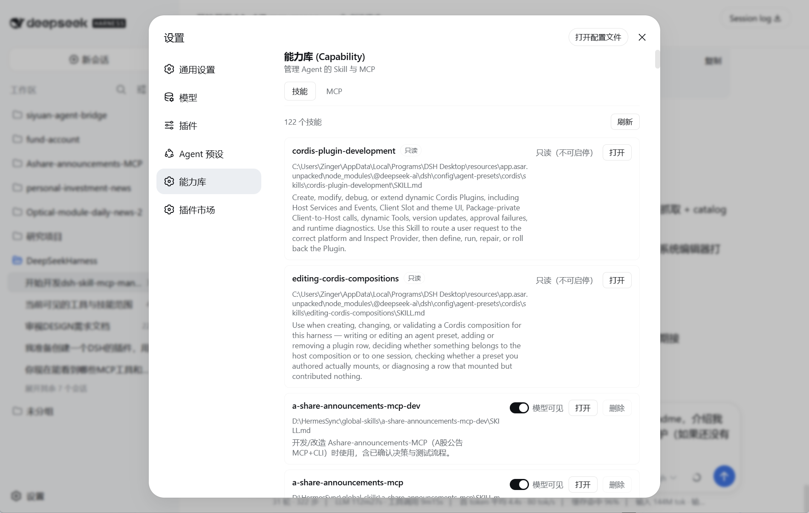
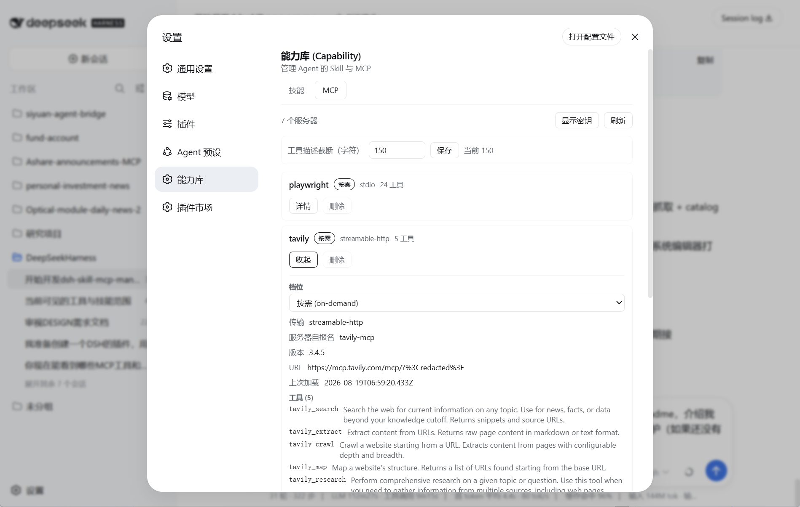

# 能力库 (Capability) —— dsh-skill-mcp-manager

> 把 DSH 的 Skill 与 MCP 收进一个可视、可管、可注入的能力库——模型只看到它真正需要的，省下每一分上下文。

面向 [DeepSeek Harness](https://github.com/deepseek-ai/deepseek-harness) 的**宿主级插件**：把 Skill 与 MCP 服务器变成**可视、可管、可注入**的统一能力库。

## 截图

| SKILL 管理 | MCP 管理 |
| --- | --- |
|  |  |

## 核心特性

### 1. 一站式管理，一个插件搞定
Skill **和** MCP 都在同一个设置页里——不用拆成两个插件。技能模型可见性开关、删除（回收站）、系统编辑器打开；MCP 档位切换、工具查看、密钥打码、删除条目。MCP 配置再也不用手改 `cordis.patch.yml`。

### 2. SKILL：多层扫描、外接库、临时隐藏
- **任意深度递归**发现 `<dir>/SKILL.md`——指一个外部技能库目录，里面所有技能自动出现。
- 关闭某技能 = 模型不可见（写 `disable-model-invocation`），但你的 `/name` 斜杠命令**照常可用**——是临时隐藏，不是删除。

### 3. MCP 按需加载（核心特点）
会话开始时，on-demand 服务器只暴露**名字 + 简短工具描述**。AI 知道每个工具存在、是干嘛的，但看不到完整 schema。因此：

- **不浪费上下文**——schema 从不进请求头；
- **没有启动延迟**——服务器只在 AI 真正需要时才连接；
- **不会加载失败导致不可用**——按需加载，失败了非致命（可重试 / 稍后重载）。

### 4. MCP 热重载
改了自己的本地 MCP 服务器？在会话里 `mcp_load` 一下即可——重连、重拉工具、新快照。**无需新开会话、无需重启 DSH。**

### 5. 原生 MCP 配置接管——卸载不丢
安装时把 profile 里所有 `@deepseek-ai/dsh-mcp-client` 条目导入注册表（默认 on-demand；原本 disabled 保持 disabled）并接管。卸载安全：`/mcp prepare-uninstall` 把每条托管条目连同完整配置交还原生客户端。

### 6. 每个 MCP 都能写你的备注
给任意服务器附加一条用户备注，会话目录里会展示给 AI，并且**永不被服务器/开发者更新覆盖**。

### 7. 自动预热
安装后插件会连接一次、抓取真实工具名与描述，目录立刻可用——之后一直走缓存。

### 8. 只管理所在 profile
插件只管理它安装进的 profile——不越权、不错位。

### 9. 注册自动校验
`mcp_register` 会**先试连 + 列工具，通过才持久化**——只有配置正确的服务器才会被放行。

## 安装

```bash
dsh plugin --profile <profile> add dsh-skill-mcp-manager
```

再在该 profile 的 `cordis.patch.yml` 加一行（参考 [`cordis.patch.example.yml`](cordis.patch.example.yml)）：

```yaml
- insert:
    - id: skill-mcp-manager
      name: 'dsh-skill-mcp-manager'
      config:
        dataDir: ''            # 空 = ~/.dsh/skill-mcp-manager
        profile: web           # 要 reconcile 的 profile
        trialTimeoutMs: 30000
        toolCallTimeoutMs: 60000
        catalogDescriptionMaxLength: 500
        toolDescriptionMaxLength: 150   # 目录里每条工具的描述截断长度
        importNativeMcp: true           # boot 时接管原生 dsh-mcp-client 条目
```

重启 profile 生效。插件挂在宿主组合里，工具对该 profile 下所有会话可见。

> **接管说明**：`importNativeMcp: true`（默认）时，原生 `dsh-mcp-client` 条目会被导入能力库并在原生层禁用——能力库成为唯一入口（三档、`mcp-catalog`、UI）。卸载插件前先跑 `/mcp prepare-uninstall` 交还条目。

## 使用

### 界面

打开 **设置 → 能力库**：

- **SKILL tab** —— 所有托管技能（bundle 型 `SKILL.md`）按路径排序：模型可见性开关、系统编辑器打开、跨平台删除。部署自带技能（`node_modules` / `app.asar` 下）为**只读**：仅查看 + 打开。
- **MCP tab** —— 所有已注册服务器（档位徽标、工具数、连接状态）：切档位、查详情（命令 / env / headers / 工具）、密钥打码/显示、加载/查看描述/断开、删除条目。顶部设置行可调目录的**工具描述截断长度**（默认 150 字符）。

### 模型工具面

三个恒定小工具——on-demand 服务器的原生 schema 永远不进模型视野。

- **`mcp_register`** —— 新增或修改 MCP 条目。试连（30s）+ 列工具后持久化；服务器自报的描述 / 版本 / 标题 / 网站 / 说明自动抓取。可复用它改档位 / 参数 / 备注；只有改连接契约才重连。
  ```text
  mcp_register { name, tier?, transport, command?, args?, env?, cwd?, url?, headers?, notes? }
  ```
  `tier` ∈ `eager` | `on-demand` | `disabled`（默认 `on-demand`）。`notes` 是用户维护、永不被覆盖。
- **`mcp_load { name, peek? }`** —— 加载 / 热重载服务器，返回完整工具定义 + 服务器自报元信息。`peek: true` 只读快照，不连接、不掉线。
- **`mcp_call { name, tool, args? }`** —— 经桥调用某个 on-demand 工具（需先 `mcp_load`）。只传结构化 `args`，不传 shell 文本、不写临时文件。

## 配置

| 字段 | 默认 | 含义 |
| --- | --- | --- |
| `dataDir` | `~/.dsh/skill-mcp-manager` | 注册表/设置目录（`~/` 会展开）。 |
| `profile` | `web` | 要 reconcile 的 profile。 |
| `trialTimeoutMs` | `30000` | `mcp_register` / `mcp_load` 的试连超时。 |
| `toolCallTimeoutMs` | `60000` | 单次 `tools/call` 超时。 |
| `catalogDescriptionMaxLength` | `500` | 目录里服务器描述的截断长度。 |
| `toolDescriptionMaxLength` | `150` | 目录里每条工具描述的截断长度（工具名始终完整显示）。可在 UI 调整。 |
| `importNativeMcp` | `true` | boot 时导入原生 `dsh-mcp-client` 条目到能力库并接管。 |

## 数据

- `~/.dsh/skill-mcp-manager/registry.json` —— 权威 MCP 注册表（version 1，`entries[]`）。
- `~/.dsh/skill-mcp-manager/settings.json` —— 插件设置（`customRecursiveDirs`、`toolDescriptionMaxLength` 等）。
- `~/.dsh/skill-mcp-manager/trash.log` —— 删除审计。
- env 值可为明文或 `$VAR` 进程环境变量引用。

## 未来方向

- **Resources & prompts** —— 服务器 `capabilities` 已在连接时记录，接入这两类是下一步。
- **UI 内编辑每条备注（notes）。**
- **按会话 / 按 Agent 的 MCP 作用域** —— 目前 eager 服务器是 host 级全局注册（与内建客户端一致）；per-agent 作用域列为远期方向。

## License

MIT
